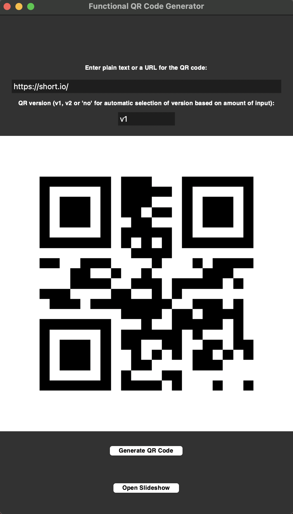
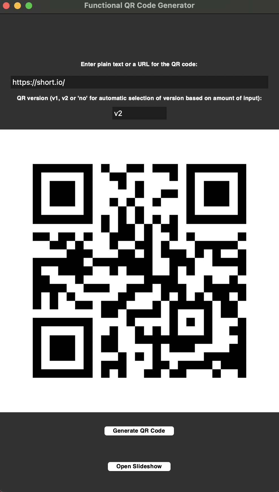
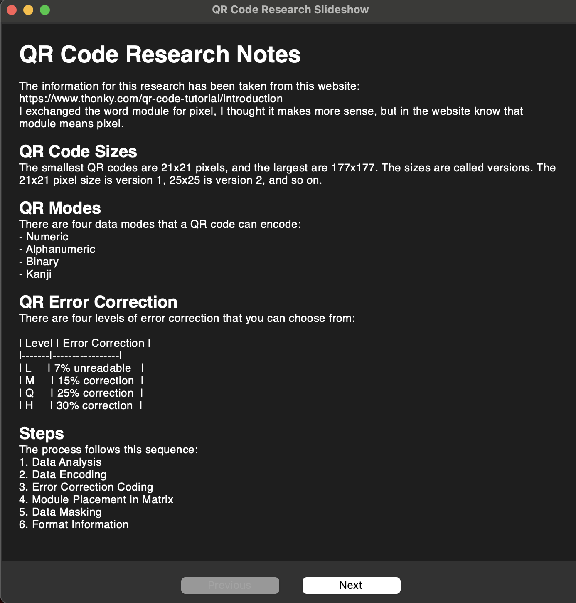
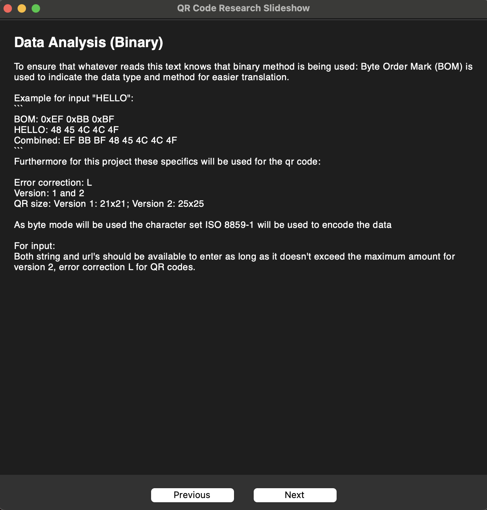
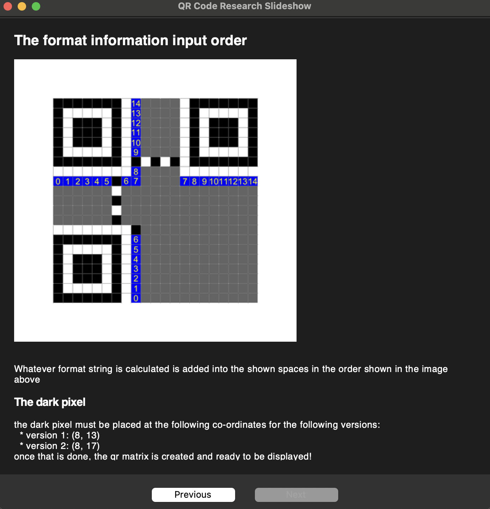

Module Code: CS2PP-24-5_S2_A <br>
Assignment report Title: CS2PP_CW2 <br>
Student Numbers: 32016360, 32010990, 32002517, 32002881, 32014440 <br>
Actual hrs spent for the assignment: 150 hours <br>
Which Artificial Intelligence tools used: ChatGPT

## a) Application Description and Instructions to operate it

This application generates functional QR codes (Version 1 or Version 2) from user-provided input, using a GUI built with Tkinter. It includes a supplementary educational slideshow that explains internal QR code mechanisms (e.g. encoding, ECC, masking).

### Instructions on how to use

1. **Requirements for the system to run**:
   - Python 3.11 must be installed
   - Libraries that must be downloaded into your local system if you don't have it already:
     ```bash
     pip install numpy matplotlib reedsolo pillow
     ```

2. **How to get the application running**:
    - Make sure you have all of the files and images downloaded into the same folder
    - Then in your terminal run the following command
   ```bash
   python3.11 qr_gui.py
   ```

3. **Interface options**:
   - Input plain text or a URL into the first text box.
   - Choose QR version: `v1`, `v2`, or `no` (for an automatic selection of a version based on what the input data manages to fit into).
   - Click **Generate QR Code** to see the result.
   - Click **Open Slideshow** to view a breakdown of QR creation process using markdown from `katieResearch.md`.

### Application Structure Diagram

```
graph TD
    GUI[qr_gui.py (Tkinter GUI)]
    SlideShow[powerpoint.py (Slide Viewer)]
    Encoding[data_encoding_correction.py (Byte + ECC Encoding)]
    Matrix[qr_matrix.py (Matrix Construction)]
    Masking[data_masking.py (Penalty Rules + Masking)]
    Notes[katieResearch.md (Slide Content)]

    GUI -->|uses 1st| Encoding
    GUI -->|uses 2nd| Matrix
    GUI -->|uses 3rd| Masking
    GUI -->|opens| SlideShow
    SlideShow --> Notes
```

---

## b) Use of Programming Techniques

### Imperative Programming
Loops and conditions are used constantly thought the entire code in every coding file. Key examples include:

- The `add_data_bits()` and `add_timing_patterns()` functions in `qr_matrix.py` use loops and conditional statements to add patterns or data into the qr matrix.
    - These two functions specifically were chosen as a result of using data that alternates:
        - up or down, left or right for add_data_bits
        - white or black in add_timing_patterns()
    - add_timing_patterns():
        - uses a nested for loop to go through the qr matrix
        - uses nested conditional statements to:
            - ensure the pattern is added in the correct place
            - ensure that the colour for the timing pattern is switched
    - add_data_bits():
        - a while loop is used to go through the entire qr matrix
        - and inside the while loop a nested for loop was used to go through two columns at the same time
        - a conditional statement is used to ensure that:
            - column 6 is skipped
            - data is entered into the appropriate places and not in any patterns or reserved areas

- In 'format_string(mask)` in `data_masking.py`
    - Operations such as `XOR` are performed step-by-step using for loops for clarity and precision.
        - This allows for each bit to be changed with no possibility of any errors happening
        - It uses a for loop
    - Furthermore a nested while loop is used:
        - The initial while loop is used to go through and get the initial format string into 10 bits long using specific operations such as XOR
        - The nested while loop ensures there are no 0's at the beginning of the string
        - Another nested while loop ensures that the generated polynomial is as long as the format string
        - The final nested while loop ensures that at the end if the format string is less than 10 it is padded to 10 bits long

- Error-handling and input validation are enforced with `assert` statements and `try/except` are used across all coding files.
    - For example 'finishedQR(qr_enter, v1_enter="no")' in `qr_matrix.py`:
        - A try and except is used when calling all of the functions to return a finished qr code
        - That in the final stages of running and calling functions to create the qr code that if something does go wrong then it is caught and the issue is shown in the terminal
        - This allows me to debug the code and more easily narrow down at what stage it failed to find the issue more quickly and also allows me to check at each stage that my code is correct
    - Also 'format_input(length, binary_length, character_count, byte_indicator, binary_list)' and 'error_correction(v1, data)' in `data_encoding_correction.py`:
        - Asserts were used in the following ways in `format_input(length, binary_length, character_count, byte_indicator, binary_list)`:
            - To ensure the length of the formatting is correct or exact
            - To ensure that the length boundaries were not crossed
        - Asserts were used in the following ways in `error_correction(v1, data)`:
            - To ensure that data was formatted and split correctly
            - To ensure that the correct length was picked for the error correction
            - To ensure result length of data and ecc is required length based on version
            - conditional statements were used in the process further helping these asserts

Overall thought the project, loops and conditional statements are used consistently and effectively to ensure that as few errors happen and that accurate data is created. The loops are sometimes nested often helping with complex navigation of the qr matrix or otherwise repetitive calculations required for the data or formatting the data.

### Functional Programming
Functional principles are applied where data needs to be transformed predictably and doesn't change the state of the data entered permanently:
- All masking pattern functions like `apply_masking_pattern0` to `apply_masking_pattern7` in `data_masking.py` are **pure functions**:
    - They return modified copies of the matrix without side effects
    - That is done as they are given a copy of the qr matrix and return the copy so no alterations are made to the actual qr code
    - This is done in case the qr matrix is needed to be used in other places without changes or for better debugging capabilities should there be an error to the actual qr matrix or this individual function

- Penalty scoring functions (`penalty_1` to `penalty_4`)
    - Also work functionally — they accept a matrix and return an integer penalty score, keeping the changes internally
    - The calculations are completed in a way that doesn't make permanent changes to the qr matrix entered through the parameters
    - Data is simply checked and information is stored as a result of viewing the data and then that information, the total penalty score for that function is returned

- apply_masking_patterns() in `data_masking.py`
    - uses the functions such as `apply_masking_pattern0`... etc. and penalty scoring functions in a way ensuring that the qr matrix is not changed permanently.
    - like in the for loop where temp_change_qr(qr_copy) is applied a copy of the current qr matrix is made and then the copy is changed
        - the copy is applied to the penalty scoring functions and then returned, where the original qr matrix has no changes done to it at all
        - this allows all qr matrices to be judged equally and efficiently
    - and for applying masking pattern functions, a copy of the qr is made and entered through the parameters of these functions and stored in a list all in one line
        - this ensures that code is more summarized and clear
        - this also ensures that any changes made are stored but are not done permanently

- The formatting and ECC generation processes ensure that new versions of the data is created rather than changing the source data.
    - This allows for better debugging and more clarity of the steps that went into the programming
    - It is easier to see data at each step as the original data did not change
    - It is easier to see where issues have formed
    - It also allows for changes to be made far more easily to whatever step of the process is needed

Overall data was consistently used in a smart and functional way within functions ensuring local variables and no change to source data where possible. This allows for less errors, easier debugging, and better understanding of intermediate steps of the code.

### Object-Oriented Programming
Reusable GUI logic is implemented using classes:
- `QRStepSlideshow` in `powerpoint.py` uses a Tkinter navigation buttons to manage the state of the slideshow, `self.index`, and UI visual aspects.
    - Given the use of a class, it is easily reusable for any kind of markdown data that would need to be formatted into a powerpoint
    - In this class, navigation allows clarity and usability for the user so that they can co through each slide of the powerpoint with relative ease and navigate information presented
    - Index was used to track the state of the powerpoint, with which slide it is on and ensure the user is being shown the correct slide. Furthermore the fact that it is not a global variable prevents possible errors and for it to be far more specific in cases where multiple PowerPoints would be used.
- Class methods like `show_slide`, `next_slide`, and `update_buttons` follow the OOP principle of encapsulation and maintainability.
    - `show_slide` ensures that each slide is cleared and updated with each element being formatted using HTML elements for better readability. 
    - `next_slide` ensures that the `show_slide` is called and increments the slide index maintaining the code ensuring the code runs smoothly.
    - `prev_slide()` does the same thing except it decrements the slide index.
    - `update_buttons()` updates the aforementioned functions but ensures based on slide index which buttons are available and which ones are not available. This allows the user to have an easier time understanding how to navigate the slides but also prevents errors for reaching for data that doesn't exist.
- The slideshow reads from `katieResearch.md`, and image memory management is handled through `self.image_refs`, ensuring proper scoping.
    - the class reads through the file `katieResearch.md`, reading them as strings and ensures that content is injected into the slides. It is dynamic allowing for any kind of information to pass through and to be used as long as it is in a usable format.
    - Images are stored within the object scope so that they may be displayed in the powerpoint. Specific image formats are used to search within the markdown file to find either the markdown or html version of the information.

Overall the use of this class ensures that this code is reusable, with modular code that is dividable within functions and easy to update and maintain within itself so that code runs smoothly. Furthermore, it allows for more improvements far more easily and additions to the applications it has so that in the future new features can be added to improve code and user experience.

---

## c) Social, Legal, and Ethical Considerations

The application takes into account key principles of accessibility, legal compliance, and ethical transparency:

### Social Considerations
- **Accessibility**:
  - All UI elements (labels, buttons) are rendered with `large, readable fonts`.
  - Large clickable areas are provided using `width`, and internal `padx/pady`.
  - `Simple`, `readable` and `straightforward`
- **Inclusivity**:
  - Inputs accept both `text` and `URLs`, accommodating various user intents.
  - GUI is visually simple with clear `instructional labels`.
  - Colours are plain but `easily readable` for anyone with colourblindness or other sight issues.
  - The design is `not overwhelming`, and is kept relatively simple. It allows users to easily navigate and understand how to use everything in the GUI and to not be overwhelmed with all of the options. This allows accessability for all ages and mental capabilities.
- **Education**:
  - The slideshow, `powerpoint.py`, is designed to teach QR code generation step by step.
  - `katieResearch.md` content is parsed, styled (headers, bold), and embedded images are shown within the slideshow dynamically. This allows for better readability with the use of some HTML use, allowing the user to identify distinct sections, to organise and go through data for more easily. Images are also incorporated to ensure better understanding of the topics explained where necessary.

### Legal Considerations
- **No personal data collection**: The application operates `entirely offline`. No logs or network requests are made.
- **Temporary memory only**: User input and QR code outputs are only `temporarily stored` to create the QR code but otherwise are not stored anywhere else.
- **Compliance with GDPR principles**: Since no data is stored or shared, this complies with `“data minimisation”` and `“privacy by design”`.

### Ethical Considerations
- **Transparency**: Users are informed of input requirements, `QR version options`, and risks associated with QR codes.
- **Risk mitigation**:
  - Invalid inputs are caught early, preventing faulty QR code generation through the use of try and except.
  - The GUI includes a clear red warning label advising users to be cautious of malicious QR content.

---

## d) Known Weaknesses and Limitations

While functional and educational, the application has known flaws and areas for improvement:

- **Limited QR Versions**: Only Version 1 `(21×21)` and Version 2 `(25×25)` are supported. Higher versions with increased data capacity are not handled. This leads to issues when users intend on entering large amounts of data which the current code does not have the capacity to manage.
- **ECC Interleaving**:
    - Reed-Solomon error correction works but lacks proper interleaving.
- **No Scanning/Exporting**:
  - Generated QR codes cannot be exported as `PNG/SVG`.
  - Users must manually screenshot or recreate them elsewhere.
  - This creates extra steps for the users as they are required to run this code and enter the data each time, instead of allowing them more flexibility with the use of the QR code.
- **GUI Responsiveness**: Due to limitations of Tkinter, buttons can occasionally feel unresponsive. This is mitigated by explicitly increasing their clickable area via `width`, `height`, and `padx/pady`.
- **Basic Markdown Parser**: The slideshow supports `#` headers, `**bold**`, and image embedding, but lacks full proper use of Markdown/HTML (e.g., tables, graphs). Further features could also be pursued as a proper colour scheme layout for the users, or text alignment would allow better readability of the information.
- **Hardcoded Information and GUI**: The error correction level is fixed at `'01'` (Level Q). There's no GUI toggle for changing it which doesn't allow the user to pick the best possible option for them. There is also a lack of adaptability and flexibility with the GUI not allowing the user to choose the display of the application itself and QR code through colours, layout and other display functions that may improve user experience.

---

## e) Data Modelling, Input Handling, and Integrity

The application maintains strong data integrity and clear modelling practices throughout its components:

### Information Modelling
- The QR matrix is modelled as a 2D list for a `qr` of 21×21 or 25×25 elements.
- Each element can represent:
  - Reserved/pattern zones: `'B'`, `'W'`, `'R'`
  - User data bits: `0` or `1`
- Bit streams are modelled as python lists of `'0'` and `'1'` characters.

### Input Handling
- GUI ensures inputs are not empty before processing:
  ```python
  if not text or not version:
      messagebox.showwarning(...)
  ```
- `try/except` is used for critical failures like file loading and format validation:
  ```python
  try:
      with open("katieResearch.md") as f:
          ...
  except FileNotFoundError:
      raise ...
  ```

### Data Integrity and Security
- Assertions validate intermediate correctness:
  - Length of ECC
  - Final matrix dimensions
  - Number of data codewords
- The `format_string()` function ensures that the final format string is 15 bits long using both assertions and XOR verification.
- Error correction is applied via `reedsolo.RSCodec`, preventing any incorrect or corrupt data.
- Image loading for the slideshow verifies file existence and catches exceptions when rendering:
  ```python
  if Path(image_path).exists():
      ...
  else:
      text.insert(tk.END, "[Missing image]")
  ```

---

## f) Real-World Applicability and Use Cases

The QR Generator is suited for several practical domains:

### 1. **Education and Teaching**
- The modular slideshow and GUI support classroom demonstrations of:
  - Binary encoding
  - Masking strategies
  - Reed-Solomon ECC
  - Patterns and data added to a qr
  - Formatting information
- Great for visual learners and self-guided study.

### 2. **Marketing and Promotion**
- Can generate QR codes for URLs (e.g., event signups, product pages).
- Static QR generation is ideal for flyers, posters, or product packaging.
- A simple and easy design that is not overwhelming for the user to navigate.

### 3. **Research and Tracking**
- Could be adapted to generate short QR IDs for:
  - Sample tracking in labs
  - Class qr codes for student attendance
  - Links to educational material

### 4. **Developer Tooling**
- A wonderful beginners guide to creating a basic QR code and understanding the basics before moving to more complex aspects of a QR code.
- Shows how to implement QR features from scratch using Python and low-level logic.
- No complex libraries are used, and it is easy to see many individual key aspects of the process that are critical to understanding.

---


## g) Demonstration of Functionality (Version 1)

### Input V1
```
Text: https://short.io/
Version: v1
```

### Intermediate Proofs (from code):

##### data_encoding_correction.py

Code:
```
if __name__ == '__main__':
    count, byte, binary_list = manage_input("https://short.io/")
    print(f"Binary count: {count}, byte mode: {byte}, binary list data: {binary_list}")
    v1, formatted_data = putting_it_togetherVersion(count, byte, binary_list, True)
    print(f"Is it version 1: {v1}, and formatted data: {formatted_data}")
    bit_stream, v1 = error_correction(v1, formatted_data)
    print(f"Data now with error correction: {bit_stream}")
```

terminal output: <br>
```
python3.11 data_encoding_correction.py 
Binary count: 00010001, byte mode: 0100, binary list data: ['01101000', '01110100', '01110100', '01110000', '01110011', '00111010', '00101111', '00101111', '01110011', '01101000', '01101111', '01110010', '01110100', '00101110', '01101001', '01101111', '00101111']
Is it version 1: True, and formatted data: 01000001000101101000011101000111010001110000011100110011101000101111001011110111001101101000011011110111001001110100001011100110100101101111001011110000 
Data now with error correction: 0100000100010110100001110100011101000111000001110011001110100010111100101111011100110110100001101111011100100111010000101110011010010110111100101111000010001111110100010100111100110010010011101011001111001101 
```

##### qr_matrix.py

code: <br>
```
if __name__ == '__main__':
    # The qr is created here with the data from error_encoding_correction and then shown in the terminal
    encoded_data, v1 = data_encoding_correction.enterData("https://short.io/", "v1")
    bit_stream = [int(bit) for bit in encoded_data]

    qr = generate_qr_matrix(v1, bit_stream)
    qr_string = ''
    for i in range(len(qr)):
        string = ''
        for j in range(len(qr[i])):
            string += str(qr[i][j]) + " "
        qr_string += string + "\n"
    print("Resulting qr string: ")
    print(qr_string)

    # the test is done to see how data is entered in add_data_bits function
    test()
```

terminal output: <br>
```
python3.11 qr_matrix.py 
Resulting qr string:

B B B B B B B W R 1 1 0 1 W B B B B B B B 
B W W W W W B W R 1 1 1 0 W B W W W W W B
B W B B B W B W R 0 0 1 0 W B W B B B W B 
B W B B B W B W R 0 1 0 1 W B W B B B W B 
B W B B B W B W R 1 1 0 1 W B W B B B W B 
B W W W W W B W R 1 1 1 0 W B W W W W W B 
B B B B B B B W B W B W B W B B B B B B B 
W W W W W W W W R 0 0 0 1 W W W W W W W W 
R R R R R R B R R 0 0 1 1 R R R R R R R R 
1 1 1 1 1 0 W 0 1 0 1 0 1 1 1 0 1 1 0 1 1 
0 0 0 0 0 0 B 0 0 0 0 0 0 1 1 0 0 0 0 1 0 
1 1 1 1 1 1 W 1 1 1 1 0 0 1 0 1 1 1 0 0 0 
1 0 0 1 0 1 B 0 0 1 1 1 0 1 1 1 1 1 1 0 1 
W W W W W W W W R 1 1 1 1 0 0 0 1 1 0 0 1 
B B B B B B B W R 1 0 1 0 1 1 0 0 0 0 1 0 
B W W W W W B W R 0 0 0 1 1 0 0 1 1 0 1 0 
B W B B B W B W R 1 0 0 0 0 1 0 1 1 1 0 0 
B W B B B W B W R 1 0 1 1 0 1 1 1 0 0 1 0 
B W B B B W B W R 0 0 1 0 0 0 0 0 0 0 0 0 
B W W W W W B W R 1 1 1 1 1 0 1 1 1 0 0 0 
B B B B B B B W R 1 1 1 1 0 1 0 0 1 1 1 0 


This shows the order of input of data in matrix:
  B  B  B  B  B  B  B  W  R137136135134  W  B  B  B  B  B  B  B 
  B  W  W  W  W  W  B  W  R139138133132  W  B  W  W  W  W  W  B 
  B  W  B  B  B  W  B  W  R141140131130  W  B  W  B  B  B  W  B 
  B  W  B  B  B  W  B  W  R143142129128  W  B  W  B  B  B  W  B 
  B  W  B  B  B  W  B  W  R145144127126  W  B  W  B  B  B  W  B 
  B  W  W  W  W  W  B  W  R147146125124  W  B  W  W  W  W  W  B
  B  B  B  B  B  B  B  W  B  W  B  W  B  W  B  B  B  B  B  B  B 
  W  W  W  W  W  W  W  W  R149148123122  W  W  W  W  W  W  W  W 
  R  R  R  R  R  R  B  R  R151150121120  R  R  R  R  R  R  R  R 
201200199198185184  W183182153152119118 73 72 71 70 25 24 23 22 
203202197196187186  B181180155154117116 75 74 69 68 27 26 21 20
205204195194189188  W179178157156115114 77 76 67 66 29 28 19 18 
207206193192191190  B177176159158113112 79 78 65 64 31 30 17 16 
  W  W  W  W  W  W  W  W  R161160111110 81 80 63 62 33 32 15 14 
  B  B  B  B  B  B  B  W  R163162109108 83 82 61 60 35 34 13 12 
  B  W  W  W  W  W  B  W  R165164107106 85 84 59 58 37 36 11 10 
  B  W  B  B  B  W  B  W  R167166105104 87 86 57 56 39 38  9  8 
  B  W  B  B  B  W  B  W  R169168103102 89 88 55 54 41 40  7  6 
  B  W  B  B  B  W  B  W  R171170101100 91 90 53 52 43 42  5  4 
  B  W  W  W  W  W  B  W  R173172 99 98 93 92 51 50 45 44  3  2 
  B  B  B  B  B  B  B  W  R175174 97 96 95 94 49 48 47 46  1  0 
  ```

##### data_masking.py

code:
```
if __name__ == '__main__':
    #qr = finishedQR("https://short.io/", "v2")
    qr, v1 = qr_matrix.return_the_qr("https://short.io/", 'v1')
    qr_best, mask = apply_masking_patterns(qr)
    print(f"QR with mask {mask}: ")
    qr_string = ''
    for i in range(len(qr_best)):
        string = ''
        for j in range(len(qr_best[i])):
            string += str(qr_best[i][j]) + " "
        qr_string += string + "\n"
    print(qr_string)
    
    format_bits = format_string(mask)
    print(f"Formatted bits for mask {mask}: {format_bits}")
    qr = placeDarkModule(qr_best, v1)
    qr = input_format_string(qr, format_bits)
    print(f"QR with mask {mask}, that has format string inside: ")
    qr_string = ''
    for i in range(len(qr)):
        string = ''
        for j in range(len(qr[i])):
            string += str(qr[i][j]) + " "
        qr_string += string + "\n"
    qr = changeQR(qr)
    print(qr_string)
```

terminal output: <br>
```
python3.11 data_masking.py
QR with mask 4: 
B B B B B B B W R 1 1 0 0 W B B B B B B B 
B W W W W W B W R 1 1 1 1 W B W W W W W B 
B W B B B W B W R 1 1 0 0 W B W B B B W B 
B W B B B W B W R 1 0 1 1 W B W B B B W B 
B W B B B W B W R 1 1 0 0 W B W B B B W B 
B W W W W W B W R 1 1 1 1 W B W W W W W B
B B B B B B B W B W B W B W B B B B B B B 
W W W W W W W W R 1 1 1 1 W W W W W W W W 
R R R R R R B R R 0 0 1 0 R R R R R R R R 
0 0 0 1 1 0 W 1 0 0 1 0 0 0 0 0 1 1 1 0 0 
0 0 0 1 1 1 B 0 0 1 1 1 0 1 1 1 1 1 0 1 0 
1 1 1 0 0 0 W 1 1 0 0 1 0 1 0 0 0 0 0 0 0 
0 1 1 1 0 1 B 1 1 1 1 1 1 0 0 1 1 1 0 1 0 
W W W W W W W W R 1 1 1 0 1 1 0 1 1 1 1 0 
B B B B B B B W R 0 1 0 0 1 1 1 1 1 0 1 0 
B W W W W W B W R 1 1 1 1 1 0 1 0 0 0 1 0 
B W B B B W B W R 1 0 0 1 1 0 0 1 1 0 1 1 
B W B B B W B W R 1 0 1 0 1 0 1 1 0 1 0 1 
B W B B B W B W R 1 1 0 0 0 0 1 1 1 0 0 0 
B W W W W W B W R 0 0 0 1 1 0 0 0 0 0 0 0 
B B B B B B B W R 1 1 1 0 1 0 0 0 1 0 0 1 

Formatted bits for mask 4: 110011000101111 
QR with mask 4, that has format string inside: 
B B B B B B B W 1 1 1 0 0 W B B B B B B B 
B W W W W W B W 1 1 1 1 1 W B W W W W W B 
B W B B B W B W 1 1 1 0 0 W B W B B B W B 
B W B B B W B W 1 1 0 1 1 W B W B B B W B 
B W B B B W B W 0 1 1 0 0 W B W B B B W B 
B W W W W W B W 1 1 1 1 1 W B W W W W W B 
B B B B B B B W B W B W B W B B B B B B B 
W W W W W W W W 0 1 1 1 1 W W W W W W W W 
1 1 0 0 1 1 B 0 0 0 0 1 0 0 0 1 0 1 1 1 1 
0 0 0 1 1 0 W 1 0 0 1 0 0 0 0 0 1 1 1 0 0 
0 0 0 1 1 1 B 0 0 1 1 1 0 1 1 1 1 1 0 1 0 
1 1 1 0 0 0 W 1 1 0 0 1 0 1 0 0 0 0 0 0 0 
0 1 1 1 0 1 B 1 1 1 1 1 1 0 0 1 1 1 0 1 0 
W W W W W W W W B 1 1 1 0 1 1 0 1 1 1 1 0 
B B B B B B B W 0 0 1 0 0 1 1 1 1 1 0 1 0 
B W W W W W B W 1 1 1 1 1 1 0 1 0 0 0 1 0 
B W B B B W B W 1 1 0 0 1 1 0 0 1 1 0 1 1 
B W B B B W B W 0 1 0 1 0 1 0 1 1 0 1 0 1 
B W B B B W B W 0 1 1 0 0 0 0 1 1 1 0 0 0 
B W W W W W B W 1 0 0 0 1 1 0 0 0 0 0 0 0 
B B B B B B B W 1 1 1 1 0 1 0 0 0 1 0 0 1 
```
- **Final Output**:
  Displayed in GUI with padding + image rendering.
in qr_gui.py:
code:
```
if __name__ == "__main__":
    main()

output: <br>

```
---

### Input V2
```
Text: https://short.io/
Version: v2
```

### Intermediate Proofs (from code):

##### data_encoding_correction.py

code:
```
if __name__ == '__main__':
    count, byte, binary_list = manage_input("https://short.io/")
    print(f"Binary count: {count}, byte mode: {byte}, binary list data: {binary_list}")
    v1, formatted_data = putting_it_togetherVersion(count, byte, binary_list, 'v2')
    print(f"Is it version 1: {v1}, and formatted data: {formatted_data}")
    bit_stream, v1 = error_correction(v1, formatted_data)
    print(f"Data now with error correction: {bit_stream}")
```

terminal output: <br>
```
python3.11 data_encoding_correction.py
Binary count: 00010001, byte mode: 0100, binary list data: ['01101000', '01110100', '01110100', '01110000', '01110011', '00111010', '00101111', '00101111', '01110011', '01101000', '01101111', '01110010', '01110100', '00101110', '01101001', '01101111', '00101111']
Is it version 1: False, and formatted data: 01000001000101101000011101000111010001110000011100110011101000101111001011110111001101101000011011110111001001110100001011100110100101101111001011110000111011000001000111101100000100011110110000010001111011000001000111101100000100011110110000010001111011000001000111101100
Data now with error correction: 01000001000101101000011101000111010001110000011100110011101000101111001011110111001101101000011011110111001001110100001011100110100101101111001011110000111011000001000111101100000100011110110000010001111011000001000111101100000100011110110000010001111011000001000111101100011001011110110111101010010101111111010110100001001000010000101011111100101101000000000
```

##### qr_matrix.py

code:
```
if __name__ == '__main__':
    # The qr is created here with the data from error_encoding_correction and then shown in the terminal
    encoded_data, v1 = data_encoding_correction.enterData("https://short.io/", "v2")
    bit_stream = [int(bit) for bit in encoded_data]

    qr = generate_qr_matrix(v1, bit_stream)
    qr_string = ''
    for i in range(len(qr)):
        string = ''
        for j in range(len(qr[i])):
            string += str(qr[i][j]) + " "
        qr_string += string + "\n"
    print("Resulting qr string: ")
    print(qr_string)

    # the test is done to see how data is entered in add_data_bits function
    test()
```

terminal output: <br>
```
python3.11 qr_matrix.py 
Resulting qr string:
B B B B B B B W R 1 1 0 0 1 0 0 0 W B B B B B B B 
B W W W W W B W R 1 1 0 1 1 1 0 1 W B W W W W W B 
B W B B B W B W R 1 0 0 0 1 0 1 1 W B W B B B W B 
B W B B B W B W R 0 1 0 0 0 1 1 0 W B W B B B W B 
B W B B B W B W R 0 0 0 1 0 0 1 0 W B W B B B W B 
B W W W W W B W R 0 0 1 0 0 0 0 1 W B W W W W W B 
B B B B B B B W B W B W B W B W B W B B B B B B B 
W W W W W W W W R 0 1 1 1 0 1 1 1 W W W W W W W W 
R R R R R R B R R 0 0 1 1 0 0 1 0 R R R R R R R R
1 0 0 1 1 1 W 0 1 1 1 0 0 1 1 1 1 0 1 1 0 1 0 1 1 
1 0 1 1 1 0 B 0 1 1 1 0 1 1 1 0 1 0 1 1 1 0 0 1 0 
0 1 1 1 0 0 W 1 1 1 0 0 0 1 0 0 0 0 0 0 0 1 0 0 0 
0 1 1 0 0 0 B 1 1 0 1 0 0 0 1 1 0 1 0 1 1 1 1 1 0 
0 0 1 0 0 1 W 1 1 0 0 0 1 0 0 1 1 0 1 1 0 0 0 1 1 
0 0 1 0 1 0 B 0 1 1 1 1 0 0 0 0 0 1 1 1 1 0 0 1 0
0 0 0 0 0 0 W 0 1 0 0 1 1 0 1 1 1 1 1 1 1 1 0 0 0 
0 0 0 1 0 0 B 0 0 0 1 1 1 0 0 1 B B B B B 1 1 0 1 
W W W W W W W W R 1 1 0 0 1 1 0 B W W W B 0 0 0 1 
B B B B B B B W R 1 1 0 1 1 1 1 B W B W B 1 1 1 0 
B W W W W W B W R 1 0 0 0 1 0 0 B W W W B 0 0 1 0 
B W B B B W B W R 0 1 0 0 0 1 0 B B B B B 1 1 0 0 
B W B B B W B W R 1 1 0 1 0 0 0 0 1 0 0 1 0 1 1 0 
B W B B B W B W R 1 1 1 0 0 0 1 0 1 1 0 0 0 1 0 0 
B W W W W W B W R 1 0 1 1 0 1 1 1 0 0 1 1 0 0 0 0 
B B B B B B B W R 1 0 1 1 0 0 1 0 0 1 1 1 0 1 1 0

This shows the order of input of data in matrix:
  B  B  B  B  B  B  B  W  R137136135134  W  B  B  B  B  B  B  B 
  B  W  W  W  W  W  B  W  R139138133132  W  B  W  W  W  W  W  B 
  B  W  B  B  B  W  B  W  R141140131130  W  B  W  B  B  B  W  B 
  B  W  B  B  B  W  B  W  R143142129128  W  B  W  B  B  B  W  B 
  B  W  B  B  B  W  B  W  R145144127126  W  B  W  B  B  B  W  B 
  B  W  W  W  W  W  B  W  R147146125124  W  B  W  W  W  W  W  B 
  B  B  B  B  B  B  B  W  B  W  B  W  B  W  B  B  B  B  B  B  B 
  W  W  W  W  W  W  W  W  R149148123122  W  W  W  W  W  W  W  W 
  R  R  R  R  R  R  B  R  R151150121120  R  R  R  R  R  R  R  R 
201200199198185184  W183182153152119118 73 72 71 70 25 24 23 22 
203202197196187186  B181180155154117116 75 74 69 68 27 26 21 20 
205204195194189188  W179178157156115114 77 76 67 66 29 28 19 18 
207206193192191190  B177176159158113112 79 78 65 64 31 30 17 16 
  W  W  W  W  W  W  W  W  R161160111110 81 80 63 62 33 32 15 14 
  B  B  B  B  B  B  B  W  R163162109108 83 82 61 60 35 34 13 12 
  B  W  W  W  W  W  B  W  R165164107106 85 84 59 58 37 36 11 10 
  B  W  B  B  B  W  B  W  R167166105104 87 86 57 56 39 38  9  8 
  B  W  B  B  B  W  B  W  R169168103102 89 88 55 54 41 40  7  6
  B  W  B  B  B  W  B  W  R171170101100 91 90 53 52 43 42  5  4 
  B  W  W  W  W  W  B  W  R173172 99 98 93 92 51 50 45 44  3  2 
  B  B  B  B  B  B  B  W  R175174 97 96 95 94 49 48 47 46  1  0 
```

##### data_masking.py

code:
```
if __name__ == '__main__':
    #qr = finishedQR("https://short.io/", "v2")
    qr, v1 = qr_matrix.return_the_qr("https://short.io/", 'v2')
    qr_best, mask = apply_masking_patterns(qr)
    print(f"QR with mask {mask}: ")
    qr_string = ''
    for i in range(len(qr_best)):
        string = ''
        for j in range(len(qr_best[i])):
            string += str(qr_best[i][j]) + " "
        qr_string += string + "\n"
    print(qr_string)
    
    format_bits = format_string(mask)
    print(f"Formatted bits for mask {mask}: {format_bits}")
    qr = placeDarkModule(qr_best, v1)
    qr = input_format_string(qr, format_bits)
    print(f"QR with mask {mask}, that has format string inside: ")
    qr_string = ''
    for i in range(len(qr)):
        string = ''
        for j in range(len(qr[i])):
            string += str(qr[i][j]) + " "
        qr_string += string + "\n"
    qr = changeQR(qr)
    print(qr_string)
```

terminal output: <br>
```
python3.11 data_masking.py 
QR with mask 6: 
B B B B B B B W R 0 0 1 1 0 1 1 1 W B B B B B B B 
B W W W W W B W R 1 1 0 0 0 0 0 1 W B W W W W W B 
B W B B B W B W R 0 1 0 1 0 0 0 0 W B W B B B W B 
B W B B B W B W R 0 0 0 1 0 0 1 1 W B W B B B W B 
B W B B B W B W R 1 0 1 0 0 1 0 0 W B W B B B W B 
B W W W W W B W R 0 1 0 1 0 0 0 0 W B W W W W W B 
B B B B B B B W B W B W B W B W B W B B B B B B B 
W W W W W W W W R 0 1 1 0 1 0 1 1 W W W W W W W W 
R R R R R R B R R 1 1 1 0 1 0 0 1 R R R R R R R R 
0 0 1 1 0 1 W 0 0 1 0 0 1 1 0 1 0 0 0 1 1 1 1 1 0 
0 0 0 0 1 1 B 0 0 0 1 1 0 1 0 1 1 1 0 1 0 1 0 0 1 
1 1 1 1 1 1 W 1 1 1 1 1 1 1 0 0 1 1 1 0 0 1 1 1 1 
1 0 0 1 1 1 B 0 0 1 0 1 1 1 0 0 1 0 1 0 0 0 0 0 1 
1 1 0 0 0 1 W 0 0 0 0 0 0 1 1 1 1 0 0 0 1 0 0 1 0 
1 1 1 1 0 0 B 1 1 0 0 1 1 1 0 1 1 1 0 0 1 1 1 1 1 
1 0 1 0 1 0 W 0 0 0 1 1 0 0 0 1 0 1 0 1 0 1 1 0 1 
1 0 1 0 0 1 B 0 1 1 1 0 0 0 1 0 B B B B B 0 1 1 0 
W W W W W W W W R 1 0 1 1 1 1 0 B W W W B 0 1 1 0 
B B B B B B B W R 0 0 1 0 0 0 0 B W B W B 0 0 0 1 
B W W W W W B W R 1 0 0 1 0 1 0 B W W W B 0 0 1 1 
B W B B B W B W R 1 0 0 1 1 1 1 B B B B B 0 0 0 1 
B W B B B W B W R 1 0 0 0 0 1 0 1 1 1 0 0 0 0 1 1 
B W B B B W B W R 0 1 0 1 0 1 0 0 0 0 0 1 1 1 1 1 
B W W W W W B W R 1 1 0 0 0 1 1 0 1 1 1 1 0 1 1 1 
B B B B B B B W R 0 1 0 0 1 1 0 1 1 0 0 0 1 0 0 1 

Formatted bits for mask 6: 110110001000001 
QR with mask 6, that has format string inside: 
B B B B B B B W 1 0 0 1 1 0 1 1 1 W B B B B B B B 
B W W W W W B W 0 1 1 0 0 0 0 0 1 W B W W W W W B 
B W B B B W B W 0 0 1 0 1 0 0 0 0 W B W B B B W B 
B W B B B W B W 0 0 0 0 1 0 0 1 1 W B W B B B W B 
B W B B B W B W 0 1 0 1 0 0 1 0 0 W B W B B B W B 
B W W W W W B W 0 0 1 0 1 0 0 0 0 W B W W W W W B 
B B B B B B B W B W B W B W B W B W B B B B B B B
W W W W W W W W 1 0 1 1 0 1 0 1 1 W W W W W W W W 
1 1 0 1 1 0 B 0 0 1 1 1 0 1 0 0 1 0 1 0 0 0 0 0 1 
0 0 1 1 0 1 W 0 0 1 0 0 1 1 0 1 0 0 0 1 1 1 1 1 0 
0 0 0 0 1 1 B 0 0 0 1 1 0 1 0 1 1 1 0 1 0 1 0 0 1 
1 1 1 1 1 1 W 1 1 1 1 1 1 1 0 0 1 1 1 0 0 1 1 1 1 
1 0 0 1 1 1 B 0 0 1 0 1 1 1 0 0 1 0 1 0 0 0 0 0 1 
1 1 0 0 0 1 W 0 0 0 0 0 0 1 1 1 1 0 0 0 1 0 0 1 0 
1 1 1 1 0 0 B 1 1 0 0 1 1 1 0 1 1 1 0 0 1 1 1 1 1 
1 0 1 0 1 0 W 0 0 0 1 1 0 0 0 1 0 1 0 1 0 1 1 0 1 
1 0 1 0 0 1 B 0 1 1 1 0 0 0 1 0 B B B B B 0 1 1 0 
W W W W W W W W B 1 0 1 1 1 1 0 B W W W B 0 1 1 0 
B B B B B B B W 0 0 0 1 0 0 0 0 B W B W B 0 0 0 1 
B W W W W W B W 0 1 0 0 1 0 1 0 B W W W B 0 0 1 1 
B W B B B W B W 1 1 0 0 1 1 1 1 B B B B B 0 0 0 1 
B W B B B W B W 1 1 0 0 0 0 1 0 1 1 1 0 0 0 0 1 1 
B W B B B W B W 0 0 1 0 1 0 1 0 0 0 0 0 1 1 1 1 1 
B W W W W W B W 1 1 1 0 0 0 1 1 0 1 1 1 1 0 1 1 1 
B B B B B B B W 1 0 1 0 0 1 1 0 1 1 0 0 0 1 0 0 1 
```

- **Final Output**:

in qr_gui.py code:
```
if __name__ == "__main__":
    main()

output: <br>

```
---

#### Slideshow implementation

in powerpoint.py: <br>





...



## Visual Demonstration


<video controls width="600">
  <source src="screen_capture.mp4" type="video/mp4">
</video>


Refrences: <br>
https://www.markdownguide.org/cheat-sheet/ <br>
https://docs.python.org/3/library/tkinter.html <br>
https://www.thonky.com/qr-code-tutorial/introduction <br>
https://www.geeksforgeeks.org/python-pil-image-open-method/ <br>
https://pillow.readthedocs.io/en/stable/ <br>