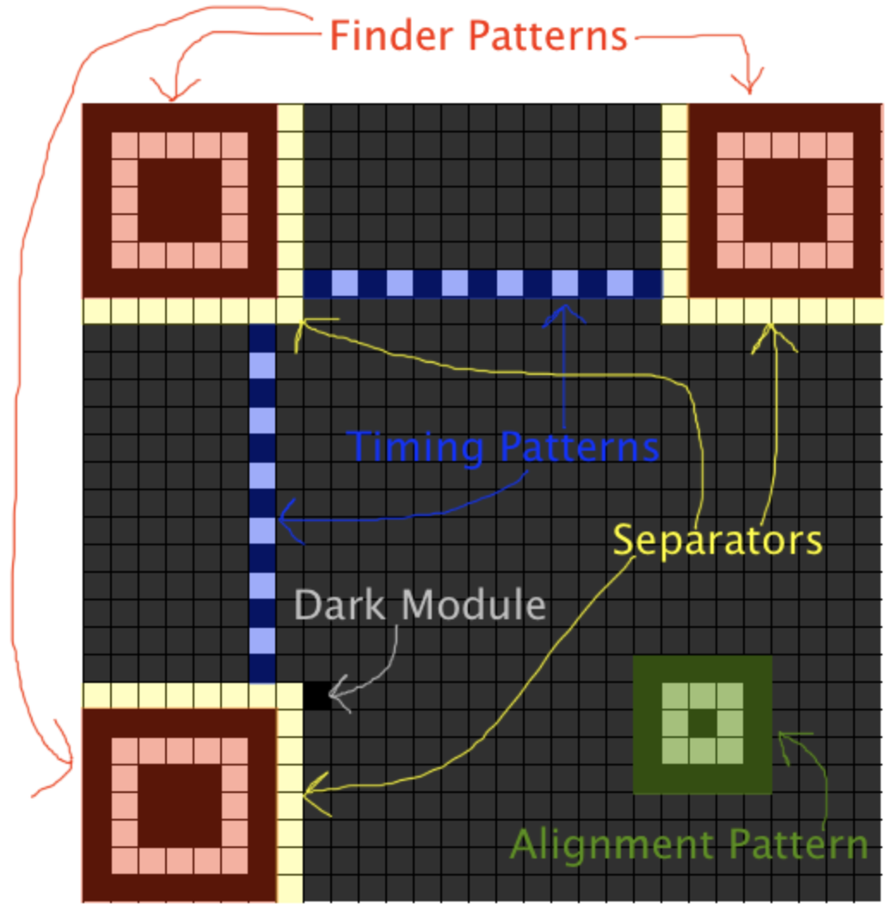
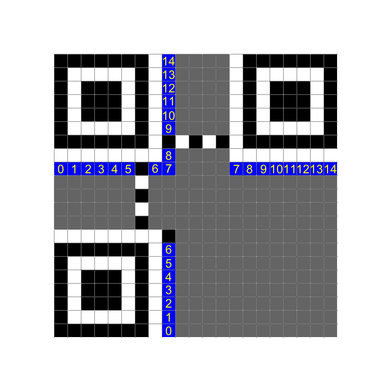

# QR Code Research Notes

The information for this research has been taken from this website: https://www.thonky.com/qr-code-tutorial/introduction
I exchanged the word module for pixel, I thought it makes more sense, but in the website know that module means pixel.

## QR Code Sizes
The smallest QR codes are 21x21 pixels, and the largest are 177x177. The sizes are called versions. The 21x21 pixel size is version 1, 25x25 is version 2, and so on.

## QR Modes
There are four data modes that a QR code can encode:
- Numeric
- Alphanumeric
- Binary
- Kanji

## QR Error Correction
There are four levels of error correction that you can choose from:

| Level | Error Correction |
|-------|-----------------|
| L     | 7% unreadable   |
| M     | 15% correction  |
| Q     | 25% correction  |
| H     | 30% correction  |

## Steps
The process follows this sequence:
1. Data Analysis
2. Data Encoding
3. Error Correction Coding
4. Module Placement in Matrix
5. Data Masking
6. Format Information

### Data Analysis (Binary)

To ensure that whatever reads this text knows that binary method is being used: Byte Order Mark (BOM) is used to indicate the data type and method for easier translation.

Example for input "HELLO":
```
BOM: 0xEF 0xBB 0xBF
HELLO: 48 45 4C 4C 4F
Combined: EF BB BF 48 45 4C 4C 4F
```
Furthermore for this project these specifics will be used for the qr code:

Error correction: L
Version: 1 and 2
QR size: Version 1: 21x21; Version 2: 25x25

As byte mode will be used the character set ISO 8859-1 will be used to encode the data

For input:
Both string and url's should be available to enter as long as it doesn't exceed the maximum amount for version 2, error correction L for QR codes.

### Data Encoding
After encoding method is selected then the text needs to be encoded.
The previous result is read to understand what method is being used to encode data.

#### Convert the Data
1. **Byte mode indicator** (add): `0100` (explains that the data is written in bytes)
2. **Character count indicator** (add): `len_of_input` (the total amount of input, which is translated into binary)
   - Example for "HELLO":
     ```
     0100 (byte mode)
     0101 (length 5)
     = 0100 0101
     ```
3. **Encoding data based on encoding mode**
  - data is converted using character set ISO 8859-1
  - this allows for a greater range of characters when using byte mode

4. **Encode using byte mode**:
   - Convert each character into an 8-bit binary string
   - Ensure one string contains all of the 8-bit binary strings

### Formatting Data

#### Formatting the Character Count Data
- Ensure the character count indicator is:
  - 8 bits long for byte mode for versions 1 to 9

- If character count indicator is not the necessary length, pad with 0's from the left
e.g.
0000100 (7 long) <- 00000100 (8 long)

#### Formatting the Input
For version 1 the required length is 8 * 19 = 152, and for version 2 the required length is 8 * 34 = 272.
Each step is carried out if the length of the strings already fit within the required length.

1. **Add a Terminator**
   - Added to the end of the total string
   - Can be up to maximum 4 0's
   - Has its own section at the end separate from the initial data and input data

2. **Adding 0's for Multiple of 8**
   - Applied to the input data converted to bytes
   - Ensure that the last byte of the data contains 8 bits
   - If not, add 0's at the end (right) until 8 bits

3. **Add Specified Bytes**
   - Specified bytes: `11101100 00010001`
   - Added at the end of the input data until required length is reached

### Error Correction Coding

This is all you need to do for encoding data with reedsolo for version 1 and version 2:
for version 1: 7 error correction codeword bits are created
for version 2: 10 error correction codeword bits are created
from the end of the formatted data the appropriate amount of bits are taken and are encoded
the error corrected codeword bits are then added back to the formatted data at the end of that data

this would look like:
version 1:
'''
        rs = reedsolo.RSCodec(7)
        ecc = rs.encode(bytes(data_codewords))[-7:]
        assert len(ecc) == expected_ecc_len
'''
version 2:
'''
        rs = reedsolo.RSCodec(10)
        ecc = rs.encode(bytes(data_codewords))[-10:]
        assert len(ecc) == expected_ecc_len
'''
and then at the end:
'''
    full_codewords = data_codewords + list(ecc)
'''

##### Bit Stream Generation
After the data is formatted and the ECC is made and added to the data ensure that the data is turned into byte format so that the data can be added into the qr matrix:
```python
bit_stream = ''
for byte in encoded_data:
    bit_stream.join(format(byte, '08b'))
```

##### Remainder bits
NOTE: this is only for version 2
there are 7 remainder bits (0's) that need to be added to the data string

### Module Placement in Matrix

The size of a QR code can be calculated with the formula `(((V-1)*4)+21)`, where V is the QR code version.

- Version 1 result: 21x21
- Version 2 result: 25x25

Patterns Image:


You can see all of the patterns here that are placed into the matrix

### Formatting Info (reserved area) Image


this is where the formatting information is placed, but for the moment it remains reserved
no data is entered there

### Overview of the QR Code
- **Finder patterns**: Three blocks in the corners of the QR code at the top left, top right, and bottom left
- **Separators**: Areas of whitespace beside the finder patterns
- **Alignment patterns**: Similar to finder patterns, but smaller. Only relevant for version 2 (placement depends on the QR code)
- **Timing patterns**: Dotted lines that connect the finder patterns
- **Dark module**: A single black module that is always placed beside the bottom left finder pattern

##### Steps

1. **Add the Finder Patterns**
   - The finder pattern has the ratio of 1:1:3:1:1 and consists of a square with several layers:
     - First layer: 7x7 black pixels
     - Second layer: 5x5 white pixels
     - Third layer: 3x3 black pixels
   - Positions:
     - Top-left finder: (0,0)
     - Top-right finder: `([(((V-1)*4)+21) - 7], 0)`
       - Version 1: (14, 0)
       - Version 2: (18, 0)
     - Bottom-left finder: `(0,[(((V-1)*4)+21) - 7])`
       - Version 1: (0, 14)
       - Version 2: (0, 18)

as this is always the same size just different co-ordinates I made a set finder matrix

2. **Add the Separators**
   - The white line surrounding the finder pattern that separates the finder from the rest of the QR Code

### Steps (Continued)

3. **Add the Alignment Patterns** (Only relevant for version 2)
   - The Alignment pattern consists of a square with several layers:
     - First layer: 5x5 black pixels
     - Second layer: 3x3 white pixels
     - Third layer: 1x1 black pixel
   - The numbers for version 2 are 6 and 18: (6, 6), (6, 18), (18, 6) and (18, 18)
   - **Note**:
     - Alignment patterns must be placed after the finder patterns and separators
     - Omit any alignment pattern that overlaps with the finder patterns or separators

4. **Add the Timing Patterns**
   - Two lines, one horizontal and one vertical, of alternating dark and light modules
   - The horizontal timing pattern is placed on the 6th row of the QR code between the separators
   - The vertical timing pattern is placed on the 6th column of the QR code between the separators
   - The timing patterns always start and end with a dark module

5. **Reserve format Information Area**
   - A strip of pixels next to the separators are reserved for the format information area:
     - Top-left finder pattern: right and bottom
     - Top-right finder pattern: bottom
     - Bottom-left finder pattern: right

6. **Place the Data Bits**
   - None of the data should be placed in any of the function patterns
   - The data is added starting from the bottom right to the top left:
     - Two columns are used to add data at the same time
     - Individual zigzags: Data is added starting from right → going to left → going one up or down to the right
     - Columns: Data is added going up the column → going left → going down → going left, and data is added two columns at a time
     - column 6 is always skipped as there is always pattern information in that row so no data can be added in that column

### Data Masking

Masking definition: Changing the current colour of the pixel to the opposite
    * black -> white
    * white -> black

##### The 8 Mask Patterns

The formula below is applied to the co-ordinates of each pixel that contains information. Masking is applied to the result of the formula.

mod = modulo
* mask 0: (row + column) mod 2
* mask 1: (row) mod 2
* mask 2: (column) mod 3
* mask 3: (row + column) mod 3
* mask 4: ( floor(row / 2) + floor(column / 3) ) mod 2
* mask 5: ((row * column) mod 2) + ((row * column) mod 3)
* mask 6: ( ((row * column) mod 2) + ((row * column) mod 3) ) mod 2
* mask 7: ( ((row + column) mod 2) + ((row * column) mod 3) ) mod 2

##### What to not mask

* function patterns (finder patterns, timing patterns, separators, alignment patterns)
* reserved areas (format information area, version information area)

##### Choosing a Mask

Apply each formula to each pixel with the matrix data and then give each mask a total penalty score adding up the penalty scores obtained from the penalty rules.
The mask with the lowest penalty score is the most efficient and therefore chosen.

### The penalty rules:

1. If a row or column has 5 same coloured pixels next to each other
  * Check each row one by one and then each column one by one
  * If there are 5 consecutive pixels of the same colour then 3 points are added
  * Additionally a point is added for each additional pixel that is the same colour after 5
  * the total points for the rows and columns are added together

2. If a 2x2 pixel area has the same colour anywhere in the QR code
  * if a 2x2 pixels of the same colour are found then 3 points are added
  * for any other blocks found with at least 2x2 pixels of the same colour, add 3 points
    * note: it doesn't matter if the blocks found overlap, searching like this should take care of blocks that are larger than 2x2
  * so overall the points should be calculated as: (amount of 2x2 same coloured pixels) x 3

3. If there is a pattern that looks similar to a finder
  * If the pattern is as follows wether vertically or horizontally ad 40 points (B=black, W=white):
    * B W B B B W B W W W W
    * W W W W B W B B B W B

4. The larger the difference between the amount of white and black pixels, the more penalty is given:
  *Calculate the percent of pixels in the matrix that are dark: (darkpixels / totalpixels) * 100
  * Determine the previous and next multiple of five of this percent.
    * For example, for 43 percent, the previous multiple of five is 40, and the next multiple of five is 45.
  * Subtract 50 from each of these multiples of five and take the absolute value of the result.
    * For example, |40 - 50| = |-10| = 10 and |45 - 50| = |-5| = 5.
  * Divide each of these by five.
    * For example, 10/5 = 2 and 5/5 = 1.
  * Finally, take the smallest of the two numbers and multiply it by 10, the result are the points which should be added.
    * In this example, the lower number is 1, so the result is 10

### Example

 Over here is an example applying all of the rules, where each mask pattern is applied and evaluated using the penalty rules.
 Mask 0 has the lowest amount of penalties so that is the mask chosen to be used when outputting the final QR code.


### Format Information

The format information string makes the use of whichever ECC was used and which mask was used that has the lowest amount of penalties.
This is to help differentiate from the 32 different possible format strings with all the possible masks that can be used (32 = 4(error correction levels) x 8(mask patterns)).

Since we will only use L, here are all of the format information bits based on mask that can be used that you should have as a result of the calculations:
  * mask 0: 111011111000100
  * mask 1: 111001011110011
  * mask 2: 111110110101010
  * mask 3: 111100010011101
  * mask 4: 110011000101111
  * mask 5: 110001100011000
  * mask 6: 110110001000001
  * mask 7: 110110001000001

calculating the format string:

the ECC is used first: ECC L -> 01
then the mask that is used, eg. 3 -> 011

format information = ECC + mask + ten 0's
generator polynomial = 10100110111

the 0's are removed from the beginning of the format information
and the generator polynomial is ensured to be the same size as the format information
  - if it is not the same size then 0's are added to the right until it is the same size
then generator polynomial is XOR'ed with the format information

the process is repeated until the format information is exactly 10 bits long
if the format information is shorter than 10 bits then 0's are added to the left until it is 10 bits long

then with the result this new format string is created: ECC + Mask + 10 bits result

lastly:
this specific string '101010000010010' is XOR'ed with the new format string, and then that is inputted into the QR matrix in the reserved spaces

### Putting the format string into the QR code

The format string is put into the reserved spaces for the format information, which is shown in the image below.
A table will be used to explain the concept and an example of a format string will be used.

The number 0 in the image refers to the most significant bit of the format string, and the number 14 refers to the least significant bit.
In other words, using the format string 110011000101111 from the example below, the numbers in the below image correspond to the format string bits as follows:

| Bit Position | 0 | 1 | 2 | 3 | 4 | 5 | 6 | 7 | 8 | 9 | 10 | 11 | 12 | 13 | 14 |
|-------------|---|---|---|---|---|---|---|---|---|---|----|----|----|----|----|
| Bit Value   | 1 | 1 | 0 | 0 | 1 | 1 | 0 | 0 | 0 | 1 | 0  | 1  | 1  | 1  | 1  |


### The format information input order



Whatever format string is calculated is added into the shown spaces in the order shown in the image above

#### The dark pixel

the dark pixel must be placed at the following co-ordinates for the following versions:
  * version 1: (8, 13)
  * version 2: (8, 17)
once that is done, the qr matrix is created and ready to be displayed!
